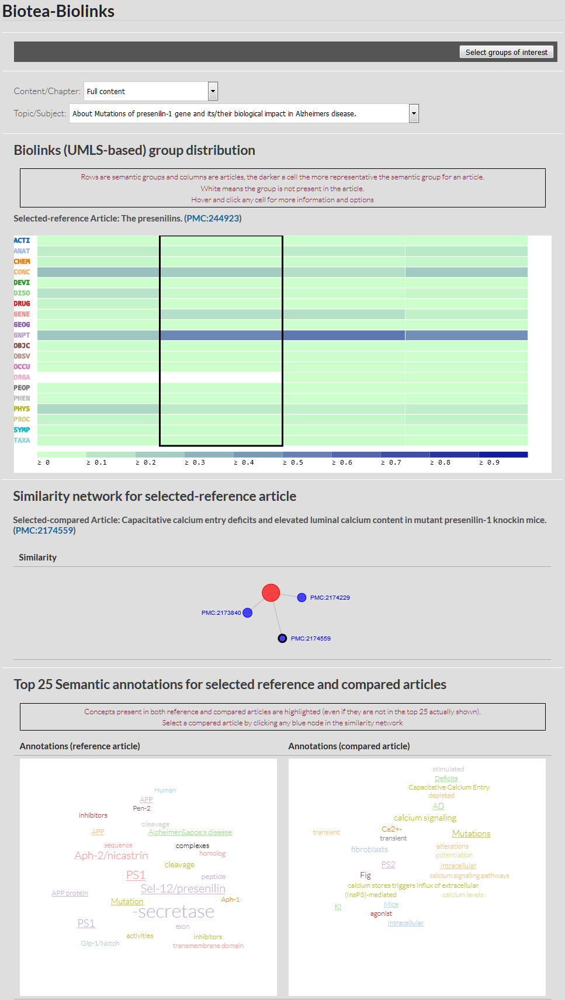

# biotea-vis-biolinks
Small application that showcases the use of the Biotea vis/io 
components using the TREC collection.

This is a proof of concept so it includes npm packages under 
development and not published, i.e., it relies on local dependencies 
that should be downloaded and and install as node_modules of this project for it 
to work. Such dependencies are:

* https://github.com/ljgarcia/biotea-io-parser
* https://github.com/ljgarcia/biotea-vis-tooltip
* https://github.com/ljgarcia/biotea-vis-annotation
* https://github.com/ljgarcia/biotea-vis-topicDistribution
* https://github.com/ljgarcia/biotea-vis-similarity

More information about what this project is about and the data used 
at http://ljgarcia.github.io/biotea-biolinks/

